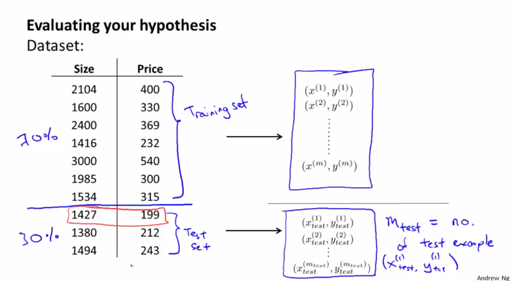
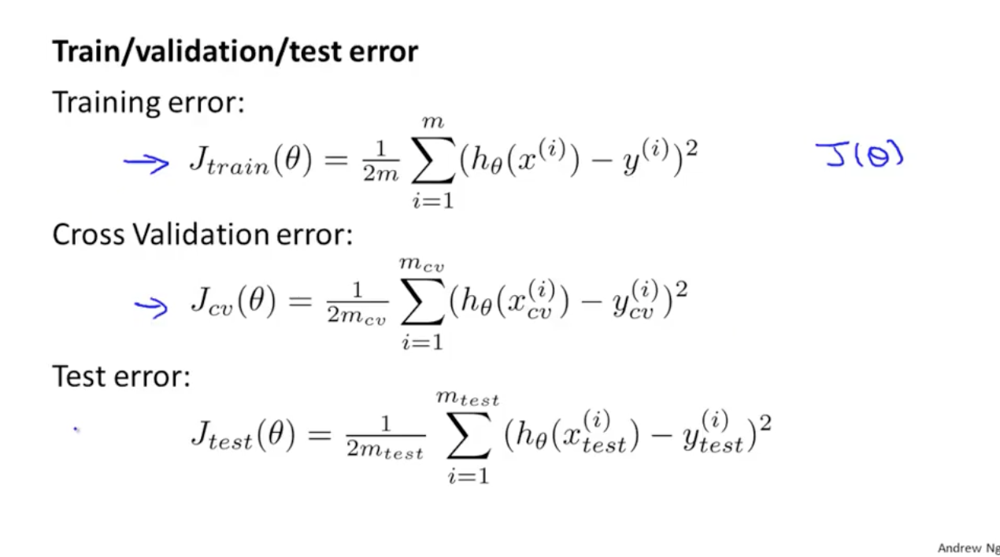

[Coursera](https://www.coursera.org/)에서 제공하는 [Machine learning by Andrew ng](https://www.coursera.org/learn/machine-learning/) 을 보고 포스팅하였습니다.

---

## Deciding What to Try Next

linear regression을 처음 배웠을 때를 생각해보자. linear regression을 이용해서 집 값을 예측하는 문제를 풀었었는데 우리가 배운 regularization등 여러 기법들을 적용하여 가설함수(hypothesis function)를 얻었지만, 이를 적용 해본 결과 에러가 너무 큰 결과를 얻었다.ㅠㅠ

그럼 에러를 줄이고 더 좋은 가설 함수를 얻기위해서 아래 항목들을 시도해 볼 수 있다.

 - training example을 더 얻는다 / 더 많은 데이터를 알고리즘을 학습시키는데 사용한다.
 - 데이터의 더 적은 특징들을 사용해본다.
 - 데이터의 특징을 더 사용해본다.
 - polynomial 한 특징들을 사용해본다. $(x^2 등등)$
 - $\lambda$를 크게 해본다.
 - $\lambda$를 작게 해본다.

위 항목들중에 아무거나 골라서 사용하는것이 아니라 Machine Learning Diagnostic를 통해서 적절한 조치를 취한다.

## Evaluating a Hypothesis

가설함수 평가하는 방법과 underfit과 overfit을 방지하는 방법에 대해서도 알아보자.

우선 overfitting한 가설함수(hypothesis function)을 생각해보자. 이전 포스팅에서도 다루었듯이 overfitting된 가설함수에 새로운 데이터를 예측하면 잘 안되는걸 알 수 있다. 그럼 우리가 학습을 통해서 얻은 가설함수가 overfitting된다는 걸 어떻게 알 수 있을까?

linear regression에서 특징이 하나인 경우 대충 계산을 해서 우리가 직접 가설함수를 그릴 수 잇었다. 하지만 특징이 매우 많아질 경우 그려진 가설함수의 모양이 어떻게 될지 예측하기 힘들거나 불가능하다. 그렇다면 가설함수의 모양이 구불구불한 정도를 가지고 overfitting한 정도를 구분하기 힘들기 때문에 다른  방법으로 가설함수를 평가해야한다.

일반적으로는 다음방법으로 가설함수를 평가한다.

여기 10개의 데이터셋이 있다고 하자. 이중에서 랜덤으로 7개를 뽑아 training set이라고 하고 나머지 3개를 test set이라고하자. 우선 학습알고리즘으로 training set을 통해 학습을 시켜서 가설함수를 만들고, 만들어진 가설함수에 test set의 데이터들로 테스트를 한다.

### Linear regresiion 에서 테스트

일반적으로 linear regression에서 테스트를 할 때에는 다음과 같은 절차를 따른다고 한다.

전체 데이터에서 랜덤하게 뽑은 70%의 데이터를 가지고 알고리즘을 학습시킨다.(비용함수의 값이 최소가 되도록)

그리고 **test set error** 를 계산한다. test set error계산하는 데이터셋은 위에서 선택한 70%의 데이터를 제외한 30%의 데이터로 구한다.

$$
J_{test}(\Theta) = \dfrac{1}{2m_{test}} \sum_{i=1}^{m_{test}}(h_\Theta(x^{(i)}_{test}) - y^{(i)}_{test})^2
$$

### classification 에서 테스트

classification 문제에 사용되는 logistic regression 알고리즘의 테스트는 어떻게 할까?

linear regression과 비슷하게 전체 데이터중 랜덤하게 뽑은 70%의 데이터를 이용하여 알고리즘을 학습시키고 나머지 30%의 데이터로 **Misclassification error** 를 구한다. Misclassification error는 말 그대로 얼마나 잘 못 구한것인지를 구하는것이다.

$$
err(h_\Theta(x),y) =
\begin{pmatrix}
1 & h_\Theta(x) \geq 0.5\ and\ y = 0\ or\ h_\Theta(x) < 0.5\ and\ y = 1 \\
0 & otherwise
\end{pmatrix}
$$

위와 같이 가설함수의 값이 0.5보다 큰데 0으로 분류되고, 가설함수의 값이  0.5 보다 작은데 1로 분류된 경우 1을 반환하고 잘 분류 된 경우에는 0을 반환한다.

그리고 이 에러에 대한 평균은 다음과 같이 구한다.

$$
\text{Test Error} = \dfrac{1}{m_{test}} \sum^{m_{test}}_{i=1} err(h_\Theta(x^{(i)}_{test}), y^{(i)}_{test})
$$

## Model Selection and Train/Validation/Test Sets

알고리즘을 선택하기 없어 가설함수를 몇차(**polynomial**)로 표현할 것인지, 어떤 **특징** 들을 알고리즘을 학습시키는데 사용할 것인지 regularization을 할 때 $\lambda$값을 어떤걸 선택할지 결정해야 할 때 어떻게 해야할까? 이러한 문제는 **Model selection problem** 라고 한다.
데이터를 train set과 test set으로 나누는 법과 train, validation, test sets으로 바꾸는 법도 알아보자. (맞는표현인지 모르겠다. 영알못...)

이전 포스팅에서도 많이 다뤘지만 가설함수(hypothesis function)이 training set에 대해서 너무 잘 표현된다면 overfitting이 일어난다는 것을 알고 있다. 이는 새롭게 추가되는 데이터에 대해서 가설함수가 제대로 적용되지 않기 때문이다.

그럼 본격적으로 model selection problem에 대해서 이야기해보자.

어떤 polynomial을 사용해야 데이터를 적절히 표현 할 수 있을까? linear(1차), quardratic(2차), cubic(3차) 등등...

결론 부터 이야기하자면 각 차수에 대한 hypothesis  표현에 대해서 테스트를 해보고 에러 결과를 토대로 결정 하면된다.

### Validation set없이 테스트

일단 이야기를 하기 앞서 변수를 하나를 선언하자. <del>말이 좀 이상한것 같지만</del>

 - **d** : 최고차항의 차수

각 **d** 에 대 테스트를 수행하고 이들중 하나를 고른다고 하자.
가장 먼저 할 일은 첫번째 모델을 고르고 training 에러를 최소화하는 hypothesis를 구한다.
그리고 **각 $\theta$의 모임을 벡터$\Theta$라고 하자.**
d에 대한각각의 $\Theta$를 구분하기 위해 윗첨차로 (d)를 적는다. 그 다음에는 각 $\Theta$에 대해여 **test set error** 를 구한다.

그리고 이 중 test set error가 가장 적은 모델을 사용하면 된다.
결론을 말하자면 검증이 안된 모델이라 사용하는 것에 대해서 고려를 해봐야한다.

그결과 **d=5** 인 hypothesis가 에러가 가장 적다고하자. 과연 이 모델이 일반적이 데이터 셋에 대해서도 에러가 적을까?

polynomial hypothesis를 선택 할 때, d에 대한 테스트 에러가 적은것을 선택했다. 만약 다른 테스트 셋을 이용하여 test set error가 적은 거ㅅ
 이 경우 우리는 테스트 셋을 이용해 하나의 변수**d**에 대해 학습을 하였다. 만약 테스트 셋이 다를 경우에도 앞서 선택한 polynomail hypothesis가 에러가 가장 작을까? 아마 확신하기 어려울 것이다.

이런 문제를 해결하기 위해서 모델을 선택하는 방법을 달리해야한다. 일반적으로 training set과 test set 두 모델로 나누는 방법과 달리 모델을 **셋** 으로 나눈다.

 - training set
 - test set
 - **cross validation set**

보통 세 집단을 나눌때 전체 모델을 랜덤하게 60%, 20%, 20%으로 나눈다고 한다.

각각 나눈 모델에 해서 train / validation / test error를 구할 수 있다.

### Validation set를 사용하여 테스트

 1. polynomial degree **d** 에 대해서 training set을 이용하여 $\Theta$를 최적화한다.
 2. **cross validation set** 을 이용하여 **d** 에 대한 에러를 구한다. 그리고 에러가 가장 작은 polynomial모델 표현을 찾는다.
 3. $J_{test}(\Theta^{(d)})$를 이용하여 일반화 오류를 예측한다.

---

## reference

 - [Machine learning by Andrew Ng](https://www.coursera.org/learn/machine-learning)
 - [Lec38. Machine Learning(머신러닝) 교차 검증 작성자 헐멍](http://blog.naver.com/mypa3424/220576318791)
